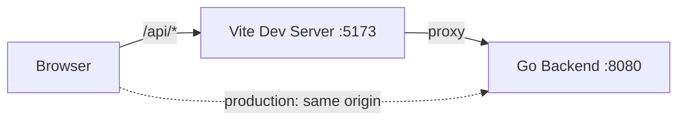

# Architecture

This document complements the [README](../README.md) with structural details: how the system is organized, which endpoints it exposes, and where it is heading. For getting started, see the README Quick Start.

## Overview

OpenPowerLab consists of two components:

- **Backend** — a Go HTTP server exposing a JSON API. Built exclusively on the Go standard library.
- **Frontend** — a Vue 3 + TypeScript single-page application served by Vite.



In development, the Vite dev server forwards `/api/*` to the backend, so browser code only ever uses relative paths. In production, build the frontend (`npm run build`) and serve it and the API from the same origin.

## Directory Layout

```
OpenPowerLab/
├── backend/
│   ├── cmd/server/        # Entry point: starts the HTTP server
│   └── internal/
│       ├── handler/       # JSON API endpoints
│       ├── middleware/    # Cross-cutting: recovery, body limit, CORS
│       └── server/        # Routing, middleware chain, graceful shutdown
├── frontend/
│   ├── src/api/           # API client and endpoint descriptors
│   ├── src/composables/   # Reactive state management (useEndpoint)
│   ├── src/components/    # UI components
│   ├── src/types/         # Shared TypeScript contracts
│   └── vite.config.ts     # Dev server and /api proxy configuration
└── docs/                  # Public documentation (this file)
```

## API Reference

All endpoints are relative to `/api`. Responses are JSON. Request bodies are limited to 64 KB; larger requests are rejected with `413`.

### `GET /api/health`

Service health check.

```json
{
  "status": "ok",
  "service": "openpowerlab-backend"
}
```

### `GET /api/ping`

Liveness/round-trip check.

```json
{
  "message": "pong"
}
```

## Design Principles

- **Standard library first** — the backend depends on zero third-party Go packages.
- **Lightweight frontend** — semantic HTML and plain CSS; no heavy UI framework.
- **Zero-trust boundaries** — every request body is size-limited; panics never crash the server.
- **Relative paths only** — the frontend never hardcodes hosts, protocols, or ports.

## Roadmap

Protocol simulation capabilities are planned in the following direction:

1. **Modbus** (TCP/RTU) — device simulation and master/slave traffic observation
2. **IEC 60870-5-104** — telecontrol station simulation
3. **IEC 61850** — substation communication modeling

The protocol cores will be implemented as a clean C/C++ layer, decoupled from the Go control plane through a well-defined IPC boundary, with raw packet tracing delivered on a channel separate from system logs. Details will be documented as capabilities land.
